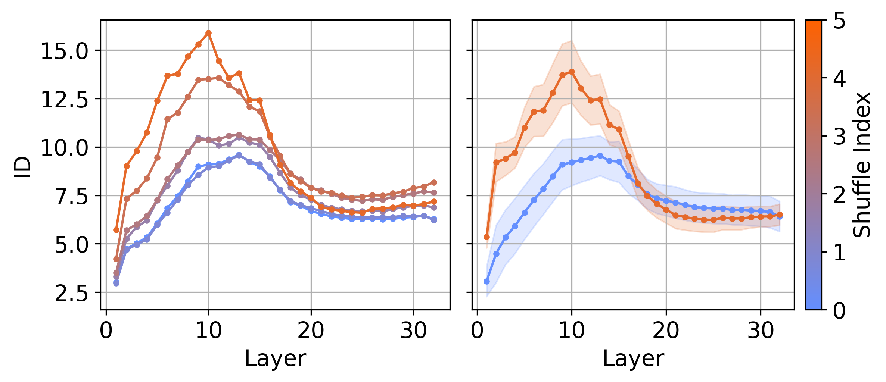
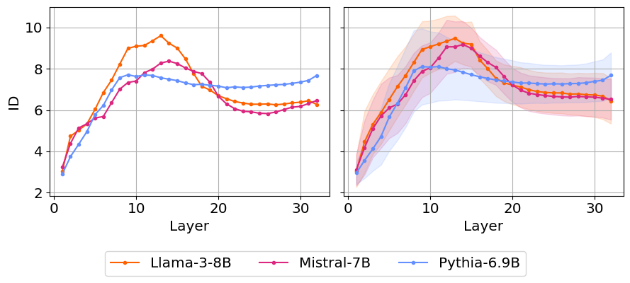

# The Geometry of Tokens in Internal Representations of Large Language Models
Source code for the paper: 'The Geometry of Tokens in Internal Representations of Large Language Models'

## Description

In this project, we analyze the geometry of tokens in the hidden layers of large language Models
using cosine similarity, intrinsic dimension (ID), and neighborhood overlap (NO). Given a prompt,
this is done in roughly two steps -

1. Extract the internal representations of the tokens -  We use the
[hidden states](https://huggingface.co/docs/transformers/v4.45.2/en/internal/generation_utils#generate-outputs)
variable from the [Transformers](https://huggingface.co/docs/transformers/index) library on Hugging Face.

2. Calculating the observables - For each hidden layer, we consider the point cloud formed
by the token representation at that layer. On this point cloud, we calculate
the cosine similarity, intrinsic dimension (ID), and neighborhood overlap (NO).
Specifically, we use the
[Generalized Ratio Intrinsic Dimension Estimator (GRIDE)](https://www.nature.com/articles/s41598-022-20991-1)
to estimate the intrinsic dimension implemented using the
[DADApy library](https://github.com/sissa-data-science/DADApy).

## Models
The list of models currently supported -
1. [Llama-3-8B](https://huggingface.co/meta-llama/Meta-Llama-3-8B)
2. [Mistral-7B-v0.1](https://huggingface.co/mistralai/Mistral-7B-v0.1)
3. [Pythia-6.9B](https://huggingface.co/EleutherAI/pythia-6.9b)


## Dataset
Currently we use the prompts from [Pile-10K](https://huggingface.co/datasets/NeelNanda/pile-10k).
We filter only prompts with atleast `1024` tokens according to the tokenization schemes
of all the above models. This results in `2244` prompts after filtering.
The indices of the filtered prompts is stored in `filtered_indices.npy`

### Shuffling experiment
For the shuffling experiment, we consider `50` random prompts from the filtered dataset,
i.e. we choose `50` prompts from the `2242` prompts. The indices of these prompts are stored in 
`subset_indices.npy`. 

## Reproducing the results

Below we show the scripts to extract token represetations and compute the 
observables for the `structured` case. Instead to run the following scripts for 
the `shuffled` case replace `--method structured` with`--method shuffled`.
Currently `--model_name` can be set to `Llama-3-8B`, `Mistral-7B`, `Pythia-6.9B`.

### Extracting the token representations and compute the corresponding distance matrices

The following script extracts the representations for `Llama-3-8B`  model and stores 
the distances matrices in the folder `results/Pile-Structured/Llama-3-8B`.
To access the models, the [hugging face login token](https://huggingface.co/docs/hub/en/security-tokens)
that starts with `hf` should be provided to run this script. 
```
python src/extract.py --input_dir results --method structured --model_name Llama-3-8B --login_token <your_hf_login_token>
```
This was computed using 4 NVIDIA H100 GPUs with a reserved memory of 720GB.
It takes around 40 minutes to extract the token representations and compute
the distance matrices for `2242` prompts for each model. It is possible to have
a more optimized configuration to run the above script.

### Calculating the observables - ID, NO and cosine similarities
The following script reads the distance matrices among the token representations
for each prompt and computes the observables (ID, NO and cosine similarity)
computation the observables in the folder `results/Pile-Structured/Llama-3-8B`. 
```
python src/summarize.py --input_dir results --method structured --model_name Llama-3-8B 
```
This was computed using an AMD Genoa CPU node with 192 cores and a reserved memory
of 336GB. It takes around 25 minutes to compute all the observables
with the NO computations taking around 20 minutes
for `2242` prompts for each model. It is possible to have a more optimized
configuration to run the above script.

### Reproducing the plots in the paper
The plots in the papers are reproduced in the two notebooks in `results/plots`

1. `shuffle_experiment.ipynb` - Reproduces the plots in section 4.2 of the paper
on 'The geometry of shuffled and unshuffled prompts'. Here is an example plot
from the notebook to get Figure 2 in the paper -

<p align="center">
    
</p>

2. `model_comparison.ipynb` - Reproduces the plots in section 4.3 of the paper
on 'Comparing token geometry of prompts in different models'. Here is an example plot
from the notebook to get Figure 5 in the paper -
<p align="center">
    
</p>

## References

- [DADApy](https://github.com/sissa-data-science/DADApy)
- [GRIDE](https://www.nature.com/articles/s41598-022-20991-1)
- [Transformers Library](https://huggingface.co/docs/transformers/index)
